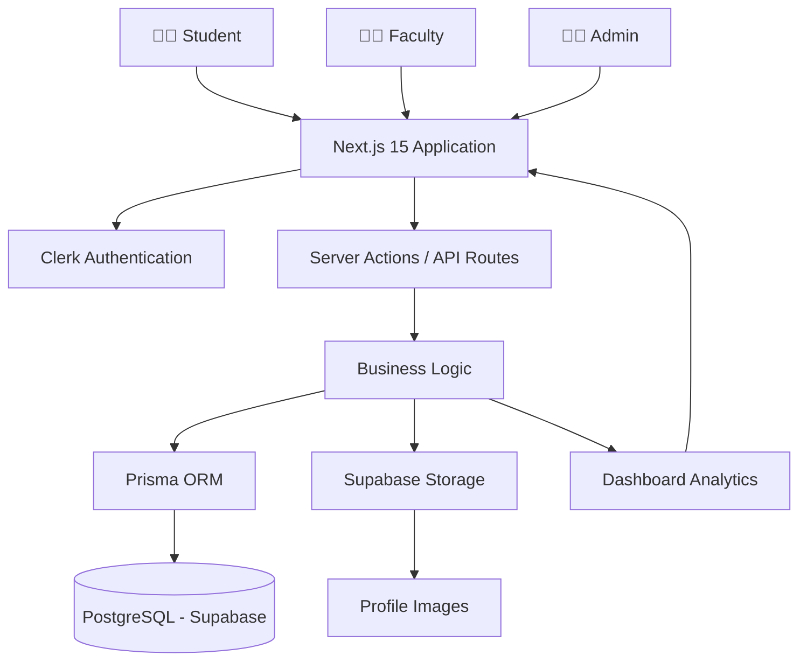
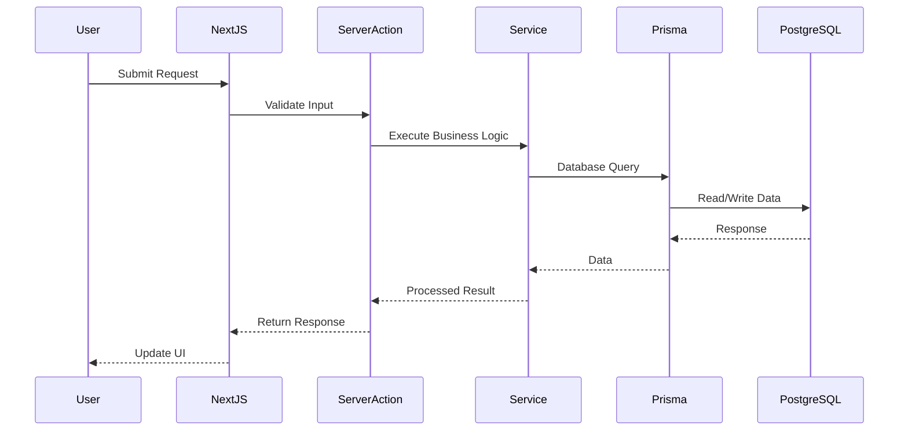
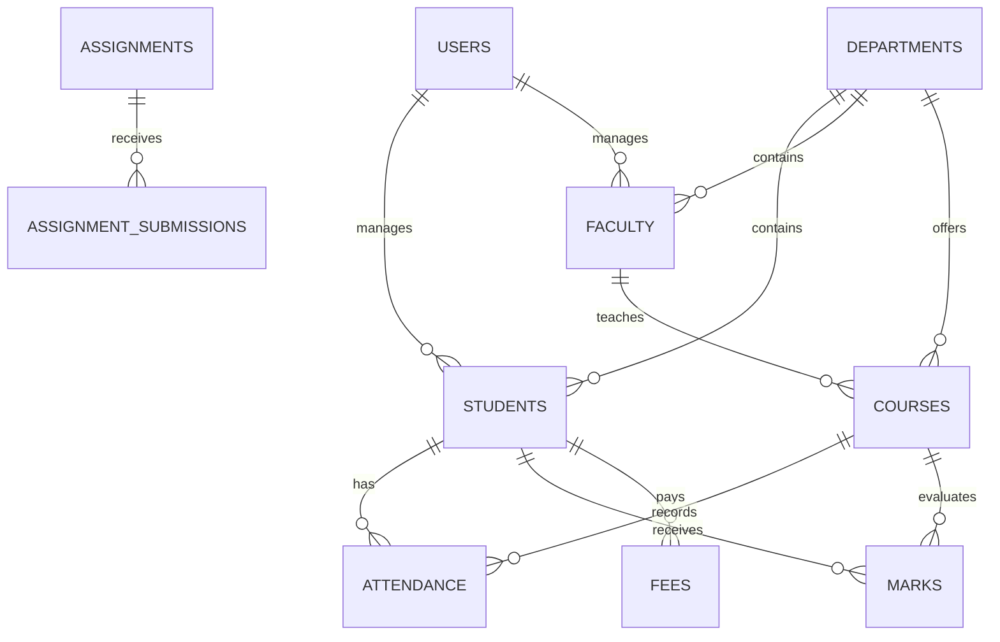
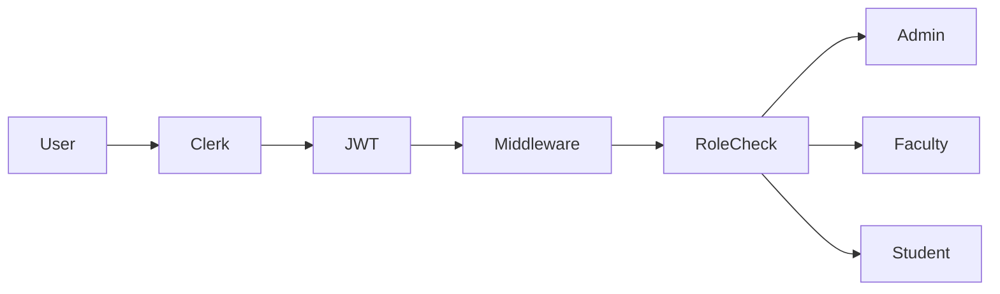
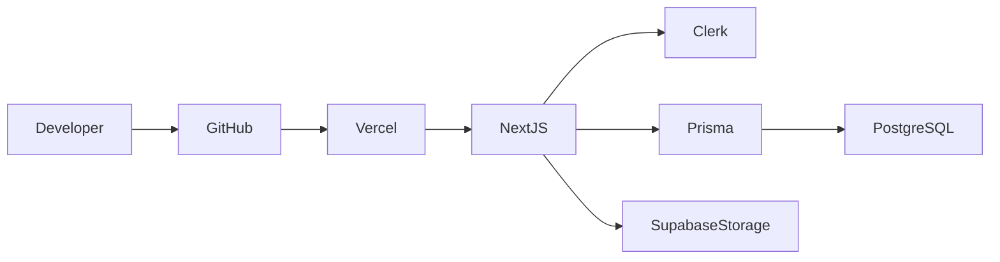

## 🏗️ System Architecture




## 📁 Folder Structure

```text
src/
├── app/
│   ├── (auth)/
│   ├── admin/
│   ├── faculty/
│   ├── student/
│   └── api/
├── components/
├── actions/
├── services/
├── lib/
├── prisma/
├── hooks/
├── types/
├── validations/
└── middleware.ts
```


## 🔄 Request Lifecycle




## 🗄️ Database Schema




## 🔐 Authentication Flow




## 🚀 Deployment




## 🛠 Tech Stack

```text
Frontend
├── Next.js 15
├── TypeScript
├── Tailwind CSS
├── shadcn/ui
├── TanStack Table
└── Recharts

Backend
├── Next.js Server Actions
├── API Route Handlers
└── Prisma ORM

Authentication
└── Clerk

Database
└── PostgreSQL (Supabase)

Storage
└── Supabase Storage

Deployment
└── Vercel
```


